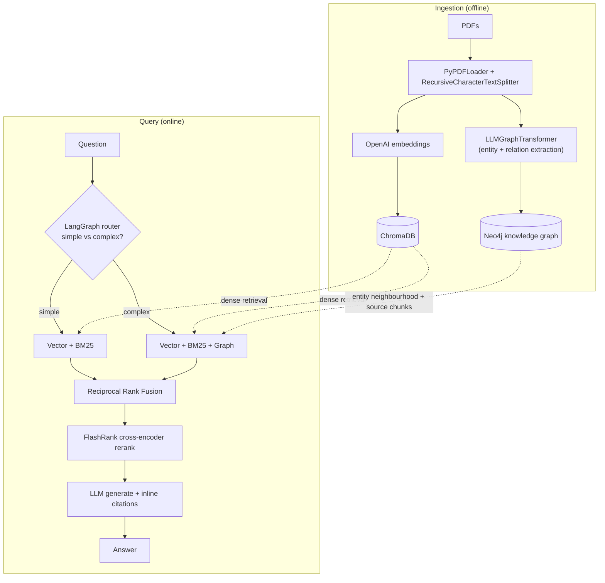

# Graph-RAG — Adaptive Hybrid Retrieval over Research Papers

A production-grade Retrieval-Augmented Generation system over a corpus of papers on
retrieval-augmented generation and dense retrieval. It combines **three-way hybrid
retrieval** (dense vectors + BM25 + GraphRAG), **cross-encoder reranking**, a
**RAGAS evaluation harness with full ablation study**, and **LangGraph adaptive
routing** — with *every architectural decision backed by measured ablation data
rather than intuition*.

> **Engineering philosophy:** discipline over scale. The corpus is small (6 papers,
> 257 chunks) on purpose — the value is in a rigorously evaluated, honestly-reported
> retrieval pipeline, not in infrastructure size.

**Live demo:** `<your-streamlit-cloud-url>`
*(First load after idle may be slow — the free tier spins down, and the Neo4j Aura
free instance auto-pauses after ~3 days. The app degrades gracefully to 2-way
retrieval if the graph database is unavailable.)*

---

## What it does

Ask natural-language questions about a set of RAG / dense-retrieval papers (HyDE,
Lost-in-the-Middle, the original RAG paper, and others). The system retrieves
relevant passages through three complementary signals, fuses and reranks them,
and generates a grounded, citation-bearing answer — choosing a lightweight or
heavyweight retrieval path depending on the question's complexity.

Two modes in the UI:
- **Pre-built corpus** — full pipeline: three-way hybrid + GraphRAG + reranking + adaptive routing.
- **Upload your own PDF** — instant in-memory 2-way indexing (vector + BM25 + rerank), no graph. Graph construction is a minutes-long offline job and deliberately kept out of the interactive request path.

---

## Architecture



**Retrieval signals, and why all three:**
- **Dense (Chroma + OpenAI embeddings)** — semantic similarity; strong on paraphrase, weak on exact terms and number-dense tables.
- **Sparse (BM25)** — lexical/keyword match; catches exact tokens and tables that dense embeddings de-prioritise.
- **Graph (Neo4j + GraphRAG)** — cross-chunk *relationships* via an entity graph; answers "how does X relate to Y" questions that neither flat signal handles, but carries auto-extraction noise.

The three are fused with **Reciprocal Rank Fusion** (rank-based, so the incompatible
score scales of cosine similarity vs BM25 never need normalising), then a
**FlashRank cross-encoder** rescoring step cuts the fused candidate set down to a
tight, query-relevant top-N — the "precision" stage that the high-recall fusion
stage cannot provide on its own.

---

## Design decisions, backed by ablation data

Every component below earned its place through a controlled ablation on a curated
evaluation set, measured with RAGAS. **All numbers are directional on a small
(8–11 question) eval set — not statistically significant — and reported with their
limits.** That honesty is the point.

### 1. Three-way hybrid: GraphRAG earns its place, but only on hard questions
A 2×2 ablation (graph on/off × rerank on/off) showed graph retrieval's contribution
is **concentrated, not uniform**: across most questions, dense + BM25 already
suffice and graph adds nothing; but on genuinely cross-chunk / relational questions
it recovers recall the flat signals miss. The aggregate gain looked like noise
(~+0.04 context-recall); per-question decomposition revealed that entire gain came
from a *single* hard question (+0.333). **Graph is a targeted insurance policy for
hard questions, not a blanket improvement — and so it earns a moderate, not high, ensemble weight.**

### 2. Reranking's value depends on how messy the candidate pool is
A cross-encoder reranker rescoring the fused candidates demonstrably removes
"consensus-but-irrelevant" passages (e.g. a figure caption that all three retrievers
upvoted on lexical overlap but that answered nothing). Notably this **reverses a
finding from an earlier project** where hybrid beat reranking at k=5 — because here
the candidate pool is messier (three signals including noisy graph facts), and a
messier pool is exactly where a cross-encoder pays off. The takeaway is conditional:
*reranking's value scales with candidate-pool noise*, not "reranking is always good."

### 3. Ensemble weights: dense-leaning is the sweet spot
A weight sweep (`0.4/0.3/0.3` vs equal vs graph-heavy vs dense-heavy) showed
answer-relevancy degrades sharply when graph is over-weighted (equal and graph-heavy
both fell to ~0.69–0.71). The chosen `0.4` dense / `0.3` BM25 / `0.3` graph sits at
the sweet spot — graph's noise disqualifies it from a high weight even though its
unique relational facts justify a seat at the table.

### 4. Adaptive routing: same quality, fewer calls on easy questions
A LangGraph router classifies each question as *simple* (single-fact, single-passage)
or *complex* (cross-passage, relational) and routes to the lightweight 2-way path or
the full graph path accordingly. On simple questions the adaptive path matches the
always-graph path **with zero quality loss** while skipping the graph's per-chunk
extraction call — confirming finding #1 from the routing side. The honest conclusion:
*adaptive gains scale with the share of simple queries in the workload* (here only
~18%, so the global gain is modest), but the mechanism is correct and the savings on
easy questions are free.

---

## Evaluation methodology (and its limits)

Quality is measured with the four RAGAS metrics — **faithfulness**,
**answer relevancy**, **context precision**, **context recall** — via a custom async
harness built on the RAGAS 0.4 collections API. The harness bakes in two hard-won
lessons:

- **Failures are recorded as `NaN`, never `0.0`.** A judge timeout or parse failure
  recorded as a zero silently corrupts the aggregate and looks like a pipeline
  regression. NaN-aware aggregation keeps failure counts visible instead of averaged away.
- **Per-question scores are retained, not just aggregates.** Aggregates hide
  redistribution — a change that helps three questions and hurts two can look flat on
  average. Several conclusions in this project were only correct because they were
  read per-question.

**Known limits of this evaluation, reported openly:**
- **Context-precision/recall are inflated by synthetic-gold bias.** Synthetic test
  questions are generated *from* source chunks, so retrieval is structurally advantaged
  at re-finding them. Faithfulness and answer-relevancy (which don't depend on the
  synthetic gold) are the trustworthy absolute signals; the context metrics are only
  read as deltas between configs, where the bias is roughly constant.
- **Small eval set → directional, not significant.** With 8–11 questions, a single
  question flips a metric by ~0.1; conclusions are stated as patterns, never as
  statistical claims.
- **`answer_relevancy` penalises correct refusals.** When the answer genuinely isn't
  in the corpus, the model correctly says so — and the metric scores that 0, conflicting
  with a high faithfulness. This metric is noisy on refusal cases and read alongside
  per-question inspection.
- **Run-to-run variance on borderline-retrievable questions.** BM25 is rebuilt
  in-memory each run and ensemble ordering has slack, so one borderline question drifts
  between runs. Flagged rather than hidden.

A representative slice of the adaptive comparison (clean run):

| config | faithfulness | answer_relevancy | context_recall |
|---|---|---|---|
| Adaptive (router) | 0.975 | 0.814 | 0.958 |
| Always 3-way + rerank | 1.000 | 0.809 | 1.000 |
| Always 2-way, no rerank | 0.946 | 0.900 | 1.000 |

(Context-precision omitted — it pinned at 1.000 across all configs due to the
synthetic-gold bias above, i.e. it had no discriminative power on this eval set.)

---

## Engineering notes (selected debugging highlights)

A few non-obvious issues solved along the way, each documenting a real constraint:

- **Neo4j `NEO4J_AUTH` only applies on first volume initialisation.** A password
  change after the data volume exists is silently ignored — diagnosed an auth failure
  by resetting the volume.
- **RAGAS `HeadlineSplitter` crashes on short pages.** The headline extractor skips
  pages below a token threshold; the splitter then fails on those pages for a missing
  `headlines` property. Fixed by feeding whole-document inputs instead of page-level.
- **RAGAS rate-limiting on long prompts.** Whole-paper prompts at high concurrency hit
  the token-per-minute limit; resolved with `RunConfig(max_workers=2)` + backoff.
- **RAGAS faithfulness `IncompleteOutputException`.** Long synthesised answers produce
  many claims, overflowing the judge's default output limit; fixed by raising the
  judge LLM's `max_tokens`.
- **LangGraph conditional edges need an explicit `path_map`.** Newer LangGraph infers
  branch targets from the routing function's return annotation; a bare `-> str` yields
  a `KeyError` on routing. Passing `path_map` (and a `Literal` return) fixes it.
- **An "unanswerable" eval question.** A hand-written question asked for an acronym
  expansion that never appears in the corpus — a 3-second string scan proved it, which
  in turn explained an anomalous metric score. Lesson: verify an eval question's answer
  *exists in the corpus* before trusting any metric on it.

---

## Tech stack

| Layer | Tooling |
|---|---|
| Orchestration | LangChain 1.x, LangGraph |
| LLM / embeddings | OpenAI `gpt-4o-mini`, `text-embedding-3-small` |
| Vector store | ChromaDB |
| Knowledge graph | Neo4j (Aura), `LLMGraphTransformer`, full-text entity linking |
| Sparse retrieval | BM25 (`rank-bm25`) |
| Fusion / rerank | `EnsembleRetriever` (RRF) + FlashRank cross-encoder |
| Evaluation | RAGAS 0.4 (four metrics), custom async ablation harness |
| Observability | LangSmith |
| Frontend | Streamlit |
| Tooling | Python 3.12, `uv` |

---

## Project structure

```
rag_graph/
├── app.py                  # Streamlit entry point (stays at root for deployment)
├── rag/                    # core importable package
│   ├── settings.py         # typed config (pydantic-settings)
│   ├── ingestion.py        # PyPDFLoader + recursive token-based chunking
│   ├── vectorstore.py      # ChromaDB build/load + embeddings
│   ├── graph_store.py      # Neo4j graph construction (LLMGraphTransformer)
│   ├── graph_retriever.py  # full-text entity linking + graph traversal
│   ├── retriever.py        # hybrid / 3-way / reranking / in-memory retrievers
│   ├── rag_chain.py        # generation chain + source formatting
│   └── adaptive_rag.py     # LangGraph adaptive router
├── scripts/                # one-off build/index entry points
│   ├── index.py            # build the Chroma vector index
│   └── index_graph.py      # build the Neo4j knowledge graph
├── evaluation/             # RAGAS testset, harness, ablation
│   ├── gen_testset.py
│   ├── curate_eval_set.py
│   ├── eval_harness.py
│   ├── ablation.py
│   └── ablation_adaptive.py
├── tests/                  # smoke / behaviour / debug scripts
├── data/                   # source PDFs (gitignored)
├── .chroma/                # persisted vector store (committed)
├── eval_set.jsonl          # curated evaluation set
├── docker-compose.yml      # local Neo4j + APOC
├── requirements.txt
└── pyproject.toml
```

---

## Getting started

### Prerequisites
- Python 3.12, [`uv`](https://github.com/astral-sh/uv)
- An OpenAI API key
- Neo4j — locally via the included `docker-compose.yml`, or a Neo4j Aura instance
- (Optional) a LangSmith API key for tracing

### 1. Install
```bash
uv sync          # or: uv pip install -r requirements.txt
```

### 2. Configure
Create a `.env` in the project root:
```bash
OPENAI_API_KEY=sk-...
LANGSMITH_TRACING=true
LANGSMITH_API_KEY=lsv2_...
LANGSMITH_PROJECT=rag-graph
NEO4J_URI=bolt://localhost:7687
NEO4J_USERNAME=neo4j
NEO4J_PASSWORD=please-change-me
```

### 3. Start Neo4j (local)
```bash
docker compose up -d
```

### 4. Build the indexes
Drop your PDFs in `data/`, then build the vector index and the knowledge graph
(run from the project root):
```bash
uv run python -m scripts.index          # Chroma vector index
uv run python -m scripts.index_graph    # Neo4j knowledge graph (LLM calls, a few minutes)
```

### 5. Run the app
```bash
uv run streamlit run app.py
```

### Evaluation & ablation (optional)
```bash
uv run python -m evaluation.gen_testset         # generate a synthetic test set
uv run python -m evaluation.curate_eval_set     # curate it into eval_set.jsonl
uv run python -m evaluation.ablation            # full 2×2 + weight-sweep ablation
uv run python -m evaluation.ablation_adaptive   # adaptive vs always-A vs always-D
```

> Scripts are run as modules (`python -m package.module`) from the project root so the
> `rag` package and relative paths resolve consistently.

---

## Deployment notes (Streamlit Community Cloud)

- Dependencies come from `requirements.txt` (the free tier reads this, not `uv.lock`).
- Secrets (`OPENAI_API_KEY`, `NEO4J_*`, `LANGSMITH_*`) go in the app's Secrets field as
  TOML; `app.py` bridges them into the environment so the typed config picks them up.
- `NEO4J_URI` must be the Aura URI (`neo4j+s://...`), not `localhost`.
- The free tier has a **1 GB RAM** ceiling; this app (ChromaDB + ONNX runtime for
  FlashRank + LangChain + LangGraph) runs close to it.
- The Neo4j Aura free instance pauses after ~3 days idle; the app degrades to 2-way
  retrieval when the graph is unreachable so a cold-linked demo still answers.

---

## Known limitations

- Auto-extracted knowledge graph carries noise: entity aliasing (e.g. `HyDE` vs its
  expanded form become separate nodes), occasional reversed/spurious relations, and a
  catch-all `PART_OF` relation. Full entity resolution is deliberately *not* done — a
  half-built dedup is less honest than a documented limitation.
- Evaluation is on a small set; see the methodology section for the full list of caveats.
- Graph construction is offline-only; uploaded PDFs get 2-way retrieval, not GraphRAG.

---

*Built as a portfolio project to demonstrate eval-driven retrieval engineering: not
just wiring components together, but measuring each one's contribution, knowing the
limits of those measurements, and chasing every anomaly to its root cause.*
